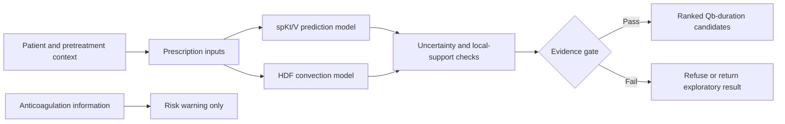

# DialyPredict

DialyPredict is a research prototype for patient-specific hemodialysis decision support. It is designed to predict dialysis adequacy and evaluate clinically adjustable prescription scenarios while making uncertainty, empirical support, and refusal conditions explicit.

> This repository contains **no patient data, real clinical records, fitted model weights, learned response surfaces, or real-world performance results**. The browser demo uses entirely synthetic values created for software testing.

## Clinical problem

For maintenance hemodialysis, a clinician may want to know:

1. What spKt/V is likely under the current prescription?
2. If the predicted value is below the clinical target, which feasible changes to prescribed blood-flow rate (Qb) or treatment duration may reach the target?
3. For HDF, what total convective volume is likely under a candidate prescription?
4. Is the proposed scenario supported by enough historical observations, and how uncertain is the estimate?

DialyPredict treats prediction and recommendation as separate tasks. A predictive model estimates an outcome for a specified scenario; a constrained search layer evaluates candidate prescriptions and may refuse to recommend when evidence is insufficient.

## System design



### Modules

- **spKt/V module:** supervised tabular regression with monotonic constraints for Qb and treatment duration.
- **HDF module:** a separate regression target for total convective volume; it is not mixed with the spKt/V endpoint.
- **Model comparison:** XGBoost and CatBoost are declared as nonlinear tabular baselines and should be compared on identical patient-disjoint folds.
- **Recommendation engine:** constrained optimization over clinically adjustable variables, with target, probability, uncertainty, and empirical-support gates.
- **Anticoagulation module:** warning and review support only; it does not autonomously prescribe anticoagulants.

## Methodological principles

- Use measured single-pool Kt/V as the intended reference endpoint after clinical label verification.
- Keep patients disjoint between development and patient-holdout evaluation sets.
- Add chronological holdout evaluation to test temporal transportability.
- Compare prescribed Qb with robust summaries of machine-recorded delivered Qb on the same complete-case cohort.
- Do not interpret observational input perturbations as causal treatment effects.
- Report prediction intervals or empirical error bands together with point predictions.
- Refuse extrapolation outside empirical support.
- Keep the clinician in the decision loop.

## Repository contents

```text
DialyPredict/
├── demo/                       # Synthetic browser demo
├── scripts/                    # Local-only safety checks
├── src/dialypredict/
│   ├── evidence.py             # Error bands and evidence levels
│   ├── modeling.py             # Unfitted XGBoost/CatBoost task definitions
│   ├── qb.py                   # Delivered-Qb summarization and source selection
│   └── recommendation.py       # Constrained recommendation engine
├── tests/                      # Synthetic unit tests
├── DATA_PRIVACY.md
└── pyproject.toml
```

## Quick start

Requires Python 3.10 or newer.

```bash
python -m venv .venv
source .venv/bin/activate
python -m pip install -e ".[dev]"
pytest
```

To view the synthetic demo:

```bash
python -m http.server 8000 --directory demo
```

Then open `http://localhost:8000`.

## Validation roadmap

The software architecture supports the following staged validation plan:

1. Internal patient-disjoint validation.
2. Chronological holdout validation.
3. Independent external-site validation.
4. Silent prospective validation without influencing treatment.
5. Clinician-in-the-loop impact and safety evaluation.

Relevant outcomes include prediction error, calibration, adequacy classification, recommendation feasibility, treatment interruption, intradialytic hypotension, circuit clotting, and vascular-access events.

## Data privacy

Real clinical data must remain in an approved local environment. Do not commit raw exports, derived patient-level tables, pseudonymous identifiers, trained weights, or real-data prediction surfaces. See [DATA_PRIVACY.md](DATA_PRIVACY.md).

## Status

Research software only. DialyPredict is not a medical device and must not be used to make clinical decisions without formal verification, external and prospective validation, ethics approval, security review, and applicable regulatory clearance.

## 中文简介

DialyPredict 是面向维持性血液透析的研究型决策支持原型，包含 spKt/V 预测、HDF 对流剂量预测、Qb/治疗时长候选方案搜索、不确定性评估和低证据拒绝机制。本仓库不包含任何真实患者数据、真实模型参数或真实数据分析结果，演示页面全部使用人工合成数据。
